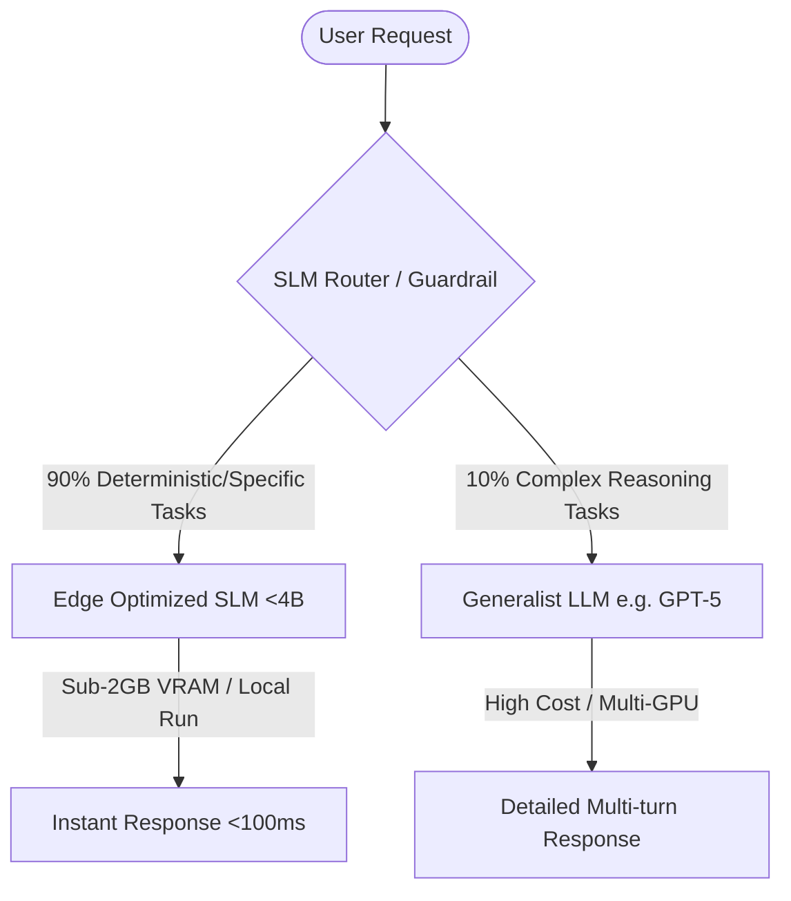
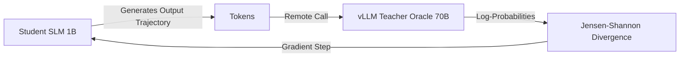

# 🚀 Open-Source Small Language Model (SLM) Masterclass

<div align="center">

[](https://www.python.org/)
[](https://pytorch.org/)
[](https://developer.nvidia.com/cuda-toolkit)
[](https://github.com/huggingface/trl)
[](https://github.com/vllm-project/vllm)

**The definitive production-grade guide to training, pruning, quantizing, and deploying Small Language Models (SLMs) in strict enterprise environments.**

---

## 💡 Overview & Core Philosophy

In production-grade systems, Large Language Models (LLMs) like **GPT-5**, **Claude 3.5 Sonnet**, and **Llama-3.1-70B** introduce severe bottlenecks: high operational cost-per-query, high Time-To-First-Token (TTFT) latency, and privacy compliance issues when processing data through cloud APIs.

**Small Language Models (SLMs)**—typically models under 4B parameters like **Qwen2.5-1.5B**, **Llama-3.2-1B**, **Phi-3.5-mini**, and **Gemma-3-4B**—solve these challenges. Modern SLMs mitigate quadratic self-attention inefficiencies through architectures like Grouped Query Attention (GQA), Dual Chunk Attention (DCA), and State Space Models (SSMs like Mamba). 

This repository serves as a **complete engineering masterclass**, showing how to take raw open-source foundational SLMs and compress them using **Knowledge Distillation**, **Parametric Pruning**, and **Numerical Quantization** into specialized, edge-ready engines.

### The "Small First" Enterprise Routing Pattern



---

## 📂 Repository Structure

```directory
├── docs/                             # Theoretical Chapters
│   ├── 01_Introduction_and_Use_Cases.md  # SLM families and top 10 enterprise use cases
│   ├── 02_Knowledge_Distillation_Deep_Dive.md  # GKD, JSD, and reasoning distillation (DeepSeek-R1)
│   ├── 03_Parametric_Pruning_Wanda.md  # Unstructured vs semi-structured (2:4) pruning
│   ├── 04_AWQ_Quantization_and_Edge_Deployment.md # GPTQ, AWQ, QLoRA (NF4) and SmoothQuant drops
│   └── 05_Global_Benchmarks_and_Evaluation.md  # MMLU/GSM8K vs VRAM matrix and LGPD compliance
├── src/                              # Production Source Code
│   ├── distillation/
│   │   └── gkd_pipeline.py           # Decoupled sequence-based GKD using TRL
│   ├── pruning/
│   │   └── wanda_heuristics.py       # Wanda pruning (Weights + Activations) & Zipf Loader
│   └── quantization/
│       └── autoawq_cli.py            # Automated AWQ compiler for INT4/128-group deployments
└── eval/
    └── benchmarks/
        └── latency_tracker.py        # 2x2 grid plotting (VRAM, TTFT, MMLU, GSM8K)
```

---

## 🔬 Core Compression Frameworks

### 1. Knowledge Distillation (KD)
We bypass classic distribution mismatches in autoregressive tasks by implementing **Generalized Knowledge Distillation (GKD)**. This approach uses the student model’s own trajectories and scores them against a massive teacher served asynchronously via **vLLM** to prevent VRAM overflow.
*   **Highlight:** Study the reasoning distillation pattern popularized by **DeepSeek-R1-Distill**, proving that distilling explicit chains of thought (`<think>` tokens) yields massive reasoning gains.
*   **Code:** [`src/distillation/gkd_pipeline.py`](src/distillation/gkd_pipeline.py)



### 2. Model Pruning (Wanda Heuristics)
We implement the state-of-the-art **Wanda** (Pruning by Weights and activations) algorithm. Unlike static magnitude pruning, Wanda evaluates importance using the analytical multiplier $S_{ij} = |W_{ij}| \cdot ||X_j||_2$, achieving up to a **300x speedup** over SparseGPT without requiring retraining.
*   **Zipf Calibration:** We replace generic "C4" dataset calibration with **Zipf-Sampling** on structured code/math data, preventing the deletion of rare but critical logical syntax.
*   **Code:** [`src/pruning/wanda_heuristics.py`](src/pruning/wanda_heuristics.py)

### 3. Model Quantization (AWQ & QLoRA)
We compile model parameters to **INT4** precision using **Activation-Aware Weight Quantization (AWQ)**. By protecting the top 1% of salient channels (where activation outliers occur) and quantizing the rest, we prevent numerical collapse.
*   **Granularity:** We explore the limits of joint activation-weight quantization, showcasing why SmoothQuant's activation scaling can cause up to a **9% accuracy drop** in complex arithmetic models compared to weight-only scaling.
*   **Code:** [`src/quantization/autoawq_cli.py`](src/quantization/autoawq_cli.py)

---

## 🛠️ Quick Start & Local Execution

### 1. Setup Environment
We provide a unified `Dockerfile` compiling CUDA kernels for Flash-Attention, AutoAWQ, and vLLM dependencies.

```bash
# Clone the repository
git clone https://github.com/vinicius/masterclass-slm-engineering.git
cd masterclass-slm-engineering

# Build the CUDA environment
docker build -t slm-masterclass .

# Run the interactive shell with GPU forwarding
docker run --gpus all -it --rm -v $(pwd):/workspace slm-masterclass
```

### 2. Running the Compressions & Benchmarks

```bash
# Run the line-by-line annotated GKD Pipeline
python src/distillation/gkd_pipeline.py

# Execute Wanda one-shot Pruning with Zipf-Sampling
python src/pruning/wanda_heuristics.py

# Quantize a model using the AWQ CLI (Locked to optimal 4-bit / 128-group)
python src/quantization/autoawq_cli.py --model_id "Qwen/Qwen2.5-1.5B" --output_dir "./qwen_awq_int4"

# Run the 4-quadrant benchmark (TTFT, VRAM, MMLU, GSM8K)
python eval/benchmarks/latency_tracker.py
```

---

## 📊 Global Benchmarks & Feasibility Analysis

Below is our comprehensive empirical benchmark matrix contrasting a giant LLM against raw and compressed SLM counterparts under restricted hardware environments:

| Parameter / Metric | LLM Generic (Llama-3.1-70B Instruct) | SLM 1 (Llama-3.2-1B BF16) | SLM 1.1 (Llama-3.2-1B SpinQuant/QLoRA 4-bit) | SLM 2 (Phi-3.5-mini-instruct 3.8B) | SLM 3 (Qwen2.5-1.5B BF16) |
| :--- | :--- | :--- | :--- | :--- | :--- |
| **VRAM Footprint** | > 140 GB | 3.18 GB | **1.9 GB - 2.2 GB** | ~ 7.6 GB | ~ 3.0 GB |
| **Decode Throughput** | ~20 - 35 t/s | 19.2 t/s (CPU/Edge) | **45.8 - 50.2 t/s** (~2.5x boost) | High (Flash-Attn) | High (Flash-Attn) |
| **TTFT Latency** | Variable (>500ms) | 1.0 s | **0.3 s** (-76% latency reduction) | Ultra-low (<200ms) | Ultra-low (<200ms) |
| **MMLU (5-shot)** | ~ 80.0+ | N/A (Edge Focus) | N/A | **69.0** | **52.4 - 69.0** |
| **Math (GSM8K CoT)** | ~ 92.0+ | N/A | N/A | **86.2** (Trillion-param tier) | > 40.0 |
| **Max Context** | 128k | 128k | 8k (Quantization limit) | 128k | 32k - 128k |
| **Operational Cost** | Very High | Extremely Low | **Almost Negligible** (< 10W Draw) | Low | Low |

### Deterministic Scopes for LGPD & Compliance
In sensitive industries like banking and healthcare, the generalist capabilities of massive LLMs can represent a liability (hallucinating out-of-domain advice, leaking prompt data). In contrast, a compressed, domain-specific SLM deployed on-premises:
1. **Ensures 100% Data Privacy (LGPD compliance)** by running entirely on local edge hardware or private clouds.
2. **Guarantees a Deterministic Scope**—preventing out-of-domain answers while reducing inference costs to near-zero.

---

## 📖 Literature Review & References

1. **Modexa (2025).** *10 SLM Use Cases That Beat LLMs on Cost.* Detailed architectural patterns demonstrating the economic advantage of "Small First" systems. [Medium Review](https://medium.com/@Modexa/10-slm-use-cases-that-beat-llms-on-cost-7e2fa0acd361)
2. **Frantar et al. (2023).** *SparseGPT: Massive Language Models Can be Pruned in One-Shot.* The foundations of 2:4 semi-structured pruning for transformer weights. [arXiv:2301.00774](https://arxiv.org/abs/2301.00774)
3. **Sun et al. (2024).** *A Simple and Effective Pruning Approach for Large Language Models (Wanda).* Integrating activation norms ($L_2$ norm of inputs) into weight selection. [arXiv:2306.11695](https://arxiv.org/abs/2306.11695)
4. **Lin et al. (2023).** *AWQ: Activation-aware Weight Quantization for LLM Compression and Acceleration.* Proving the efficacy of selective 1% outlier weight protection. [arXiv:2306.00978](https://arxiv.org/abs/2306.00978)
5. **Dettmers et al. (2024).** *QLoRA: Efficient Finetuning of Quantized LLMs.* NormalFloat 4 (NF4) representations and double quantization frameworks. [arXiv:2305.14314](https://arxiv.org/abs/2305.14314)
